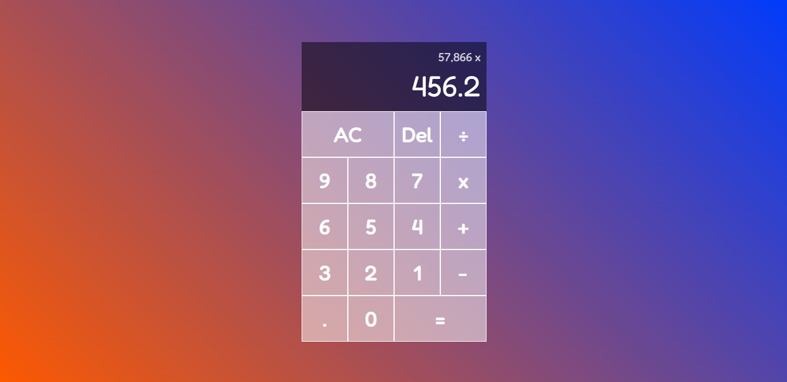

# Calculator

This is a calculator made of HTML, CSS and Javascript. 
It has all the basic functions as a normal calculator does, such as:

- Making the **four basic operations** ( addition, subtraction, multiplication and division)
- Having an All Clear and Delete buttons
- Separating thousands, millions, billions, [...] by commas and decimals by dots
- Automatically making the operation if the user already has a current operand and press an operation button

&nbsp;&nbsp;
## Preview

